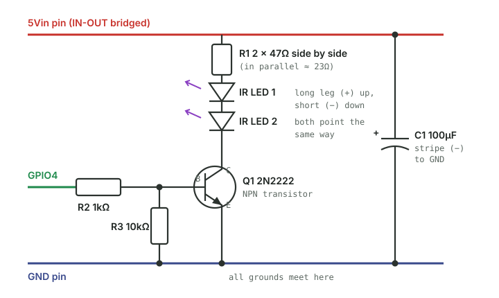
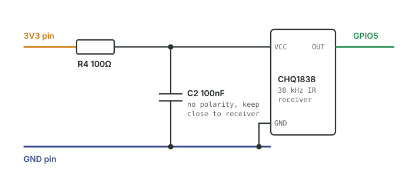
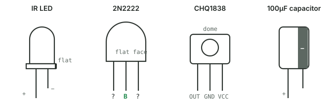
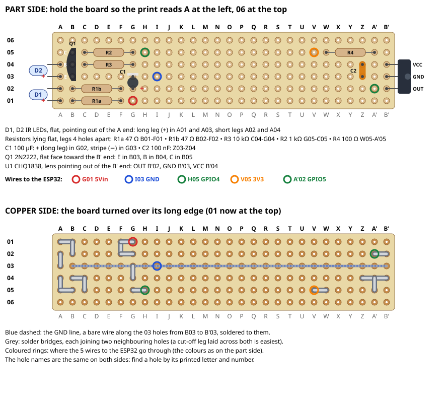

# IR Blaster Hardware (#42)

Software, pairing and how to use it: [IR-Blaster wiki page](https://github.com/CiprianTiro/stm32mp1-universal-controller/wiki/IR-Blaster).

This file is the source of truth for the hardware; the wiki page [IR-Blaster-Hardware](https://github.com/CiprianTiro/stm32mp1-universal-controller/wiki/IR-Blaster-Hardware) mirrors it.

Breadboard circuit for the ESP32-S3 IR blaster add-on
([#42](https://github.com/CiprianTiro/stm32mp1-universal-controller/issues/42)):
two IR LEDs to **send** codes and a 38 kHz IR receiver to **learn** them from
an original remote. IR only: a temperature sensor belongs on its own module
(#86), away from the ESP32's warmth.

> **Status (2026-10-01): verified on hardware.** Sends NEC codes to an LG TV,
> an IR LED strip and a small NEC projector (~2 m range), and receives/decodes the
> original remotes. Firmware: [`firmware_ir_blaster/`](../README.md).
> Two board facts cost the most time; read [Board notes](#5-board-notes-yd-esp32-s3)
> before building.

**Build the circuit with USB unplugged. Connect the board through its COM port.**

## Parts

| Ref | Part | Value / type | Notes |
|---|---|---|---|
| — | ESP32-S3 dev board | N16R8 (16 MB flash, 8 MB octal PSRAM) | two bought: one open for development, one to install |
| D1, D2 | IR LED ×2 | 940 nm, 5 mm, in series | generic, owned (the clear ones); TSAL6400 later for more range |
| Q1 | NPN transistor | 2N2222 (TO-92) | switches the LED current |
| R1 | resistor ×2 | 2 × 47 Ω in parallel (≈ 23 Ω) | LED current limit |
| R2 | resistor | 1 kΩ | base resistor |
| R3 | resistor | 10 kΩ | base pull-down |
| C1 | electrolytic capacitor | 100 µF / 50 V | **polarised** |
| U1 | IR receiver | CHQ1838 (38 kHz, VS1838B class) | active-low output |
| R4 | resistor | 100 Ω | receiver supply filter |
| C2 | ceramic capacitor | 100 nF | receiver supply filter, no polarity |

Colours in the drawings: **red** = 5V, **orange** = 3.3V, **blue** = GND,
**green** = signal to/from the ESP32, **black** = wire between parts.

## 1. Transmitter: two IR LEDs on GPIO4



1. **Current path:** 5Vin → R1 → LED 1 → LED 2 → Q1 collector → Q1 emitter →
   GND. The LEDs light only while Q1 is switched on. The same current flows
   through both, so two LEDs in series give **twice the light for free**.
2. **GPIO4 → R2 → Q1 base** switches Q1. GPIO4 HIGH = LEDs on, LOW = off.
   The firmware (RMT peripheral) toggles it 38,000 times a second, the carrier
   the receiver listens for.
3. **Why a transistor:** a GPIO gives 3.3 V and only a few tens of mA, and
   switching the LED current through the 3.3 V regulator would disturb the
   ESP32's supply. The GPIO only switches Q1; the current comes from USB via
   the **5Vin pin**, which needs the **IN-OUT bridge** (see Board notes).
4. **R1** limits the LED current. Under load the 5Vin pin gives ~4.4 V:

   ```
   I = (4.4 V − 2 × LED ≈1.35 V − Q1 ≈0.1 V) / 23 Ω ≈ 65 mA   (through both LEDs)
   ```

   Measured: LED 1's long leg reads **4.6 V off, 2.9 V on**. Fine for pulses.
   Don't hold the LEDs on for long: `ledtest` for 2–3 s only.
5. **R2 (1 kΩ)** limits the base current to (3.3 − 0.7) / 1000 ≈ 2.6 mA. The
   2N2222 has a gain of at least ~75 here, so 65 mA needs only ~1 mA. 2.6 mA
   is about 3× that, so Q1 switches fully on (measured ~0.1 V across it).
6. **R3 (10 kΩ, base to GND)** keeps the LEDs off while the ESP32 boots or is
   being flashed, when GPIO4 isn't set up yet and floats.
7. **C1 (100 µF)** stores charge for the LED pulses so they don't dip the USB
   supply. Polarised: **+ (long leg) to 5Vin, striped side (−) to GND.**

### Range steps measured (NEC projector, which is less sensitive than the LED strip)

| Setup | Range |
|---|---|
| 1 LED, 3V3, 47 Ω (~40 mA) | works, but only close (not measured) |
| 1 LED, 5Vin, 47 Ω (~63 mA) | 50–60 cm |
| 2 LEDs, 5Vin, 2 × 47 Ω (~65 mA) | 1–2 m |

(The IR LED strip reacts from further: >1 m already with one LED.)

Next for more range: TSAL6400 LEDs (narrow, intense beam) with higher pulse
current sized from their datasheet.

## 2. Receiver: CHQ1838 on GPIO5



> ⚠️ **Power the receiver from 3V3, never 5V.** Its OUT pin rises to its supply
> voltage, and ESP32 pins are **not 5 V tolerant**. On 3V3, OUT connects
> straight to GPIO5 with no resistor or level shifter. The part runs on
> 2.7–5.5 V, so 3.3 V is within spec.

1. **OUT** sits HIGH at rest (internal pull-up) and goes LOW while it sees a
   38 kHz IR burst. The firmware times those pulses; that is a "learned code".
2. **R4 + C2** filter supply noise, as the Vishay TSOP382 datasheet
   recommends. The receiver amplifies very weak signals and the LED pulses are
   nearby. The receiver draws ~1 mA, so R4 drops only ~0.1 V. Place C2 close
   to the receiver's pins.
3. The drawing shows pin **names** only. The physical leg order is in section 4.

## 3. Every connection

| From | Through | To |
|---|---|---|
| `5Vin` pin | R1 2 × 47 Ω in parallel | IR LED 1 + (long leg) |
| IR LED 1 − (short leg) | — | IR LED 2 + (long leg) |
| IR LED 2 − (short leg) | wire | Q1 collector |
| Q1 emitter | wire | `GND` |
| `GPIO4` | R2 1 kΩ | Q1 base (middle leg) |
| Q1 base | R3 10 kΩ | `GND` |
| C1 + (long leg) | — | `5Vin` |
| C1 − (striped side) | — | `GND` |
| `3V3` pin | R4 100 Ω | CHQ1838 VCC |
| CHQ1838 VCC | C2 100 nF | `GND` |
| CHQ1838 GND | wire | `GND` |
| CHQ1838 OUT | wire | `GPIO5` |

### Why these GPIOs

On the N16R8 board these pins are **off-limits**:

| Pins | Why |
|---|---|
| GPIO 26–37 | wired to the flash and the octal PSRAM inside the module; using them crashes the board |
| GPIO 0, 3, 45, 46 | strapping pins, read at reset to choose the boot mode |
| GPIO 19, 20 | USB |
| GPIO 43, 44 | serial console (UART0) |

GPIO 4 and 5 have no special function. Use the pins **printed** `4` and
`5` on the board (sometimes `IO4` / `GPIO4`). Don't count positions
along the header.

## 4. Which leg is which



| Part | How to tell |
|---|---|
| **IR LED** | Long leg = **+** (toward R1). Short leg and the flat edge of the rim = **−** (toward Q1). |
| **2N2222** | Flat face toward you, legs down: **E – B – C**, confirmed on hardware for Optimus's `2N2222 331` (only ~0.1 V across it when on). The **middle leg is always the base**. The outer two depend on the maker: `PN2222A` (Fairchild/onsemi) = **E B C**, `P2N2222A` (onsemi) = **C B E**, unbranded `2N2222` comes both ways. Read the marking and check the seller's datasheet. If E and C end up swapped nothing is damaged at 5 V; the LED is just very weak. To check: temporarily feed the base through 10 kΩ from 3V3 (no pull-down). Correct way round, ~3–3.5 V across R1; reversed, under ~0.5 V. |
| **CHQ1838** | Lens toward you, legs down: **OUT – GND – VCC**, confirmed from the [Optimus datasheet](https://www.optimusdigital.ro/ro/index.php?controller=attachment&id_attachment=4) ("TL1838", drawing marked CHQ 1838). The GND–OUT–VCC drawing on the product page is only a block diagram. Its example powers the receiver from 5V, which is fine for an Arduino but **not for the ESP32**: use 3V3. |
| **100 µF** | Striped side = **−** (to GND), long leg = **+** (to 5Vin). Reversed, it can bulge or pop. |

**IR LED vs photodiode:** a 940 nm photodiode looks almost the same as an IR
LED, and colour isn't a reliable hint. The sure test: `3V3` → 100 Ω → part
(long leg first) → `GND`, then measure across the part. An IR LED reads about
**1.2–1.3 V** (20 mA flows); a silicon photodiode ~0.6–0.7 V. A phone's front
camera usually also shows the IR LED's purple glow.

## 5. Board notes (YD-ESP32-S3)

The N16R8 boards are the **YD-ESP32-S3** layout (a copy of Espressif's
DevKitC-1 with two USB-C ports). Two things about it:

1. **Use the COM port**, not the one marked USB. COM goes through a CH343
   USB-serial chip (`/dev/ttyACM0`, ID `1a86:55d3`); flashing resets the chip
   by itself, and the firmware's `ir>` console runs there. (The native USB
   port also works for flashing, but the first time needs BOOT+RST by hand.)
2. **The `5Vin` pin is an input unless the `IN-OUT` pads are bridged.** The
   pads sit on the right edge between pins 11 and 10, labelled `IN-OUT`.
   Unbridged, a diode lets power only *into* the board: a multimeter still
   reads ~4.4 V on the pin (a tiny leak is enough for the meter), but it
   collapses below 1 V under any real load. That's what made the first tests
   fail: LEDs barely lit, and a capacitor on the pin pulled it to 1 V.
   Bridged with a drop of solder, the pin gives USB 5 V: 4.63 V idle, 4.4 V
   with the LEDs on.
   ⚠️ After bridging, **never feed an outside 5 V into `5Vin` while USB is
   plugged in**; the two supplies would push power into each other.

## 6. Before plugging in USB

- [ ] `IN-OUT` pads bridged (section 5).
- [ ] Transistor placed E–B–C, flat face toward you.
- [ ] CHQ1838 placed OUT–GND–VCC, lens toward you.
- [ ] Both 5 mm parts are IR LEDs (about 1.2–1.3 V at 20 mA), long legs toward 5Vin.
- [ ] Receiver VCC goes to **3V3**, not 5V.
- [ ] C1's stripe goes to GND.
- [ ] Multimeter beeper: `5Vin`↔`GND` and `3V3`↔`GND` don't beep (no short).
- [ ] Every GND (board, Q1 emitter, R3, C1, C2, receiver) meets on one rail.
- [ ] After power-up: `ledtest 3` keeps `5Vin` at ~4.4 V; LED 1's long leg reads ~2.9 V.

**Breadboard tip:** a DevKitC-sized ESP32-S3 is wide and covers almost all the
holes of an 830 breadboard. Placing it across the gap between two breadboards
leaves free holes on both sides.

## 7. Soldered version: the IR add-on board (perfboard)

> **Status (2026-10-01): built and verified.** Soldered from this layout
> and [BUILD.md](BUILD.md); all checks passed and the blaster sends and
> receives as on the breadboard.

The same circuit as above, soldered on a **2 x 8 cm perfboard**: 6 x 28
holes, a separate copper ring per hole, the long side lettered A..Z then
A' B' (the print starts again at A and B), the short side numbered 01..06.
The ESP32 dev board doesn't fit on it (its pin rows are 10 holes apart), so
the perfboard is an **add-on board** joined to the ESP32 by 5 wires: either
part can be replaced alone. **IR only**: a temperature sensor is its own
module (#86), away from the ESP32's warmth.

**Building it, step by step with checkboxes: [BUILD.md](BUILD.md).**



- **IR LEDs** out of the **A end** (toward the device), the **receiver's
  lens** out of the **B' end** (toward the room, where the original remote
  is pressed).
- **Resistors lying flat**, legs 4 holes apart (B01-F01, ...).
- **17 solder bridges** between neighbouring holes on the copper side and a
  **GND line** (bare wire) along the 03 holes from B03 to B'03. No other
  wires on the board.
- **Wires to the ESP32:** G01 = 5Vin, I03 = GND, H05 = GPIO4, V05 = 3V3,
  A'02 = GPIO5.

The drawing and the hole names come from `tools/perfboard.py`, which also
**checks** the layout: it follows every bridge, the GND line and the links,
and confirms each of the 10 nets joins exactly the legs the circuit says.
Change the layout there (and `python3 tools/perfboard.py --list` prints
every hole in printed names), never by hand in the SVG.

## Related

- [Device-Catalog](https://github.com/CiprianTiro/stm32mp1-universal-controller/wiki/Device-Catalog): where IR fits among all the ways the hub reaches devices
- [Device-Templates](https://github.com/CiprianTiro/stm32mp1-universal-controller/wiki/Device-Templates): the add-device wizard the blaster will appear in
- [#42](https://github.com/CiprianTiro/stm32mp1-universal-controller/issues/42): the full Definition of Done (firmware, pairing, code library, AC protocols)
